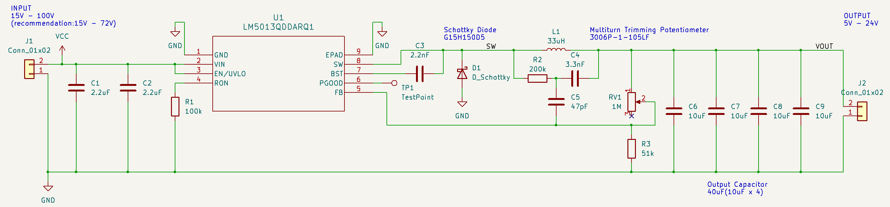
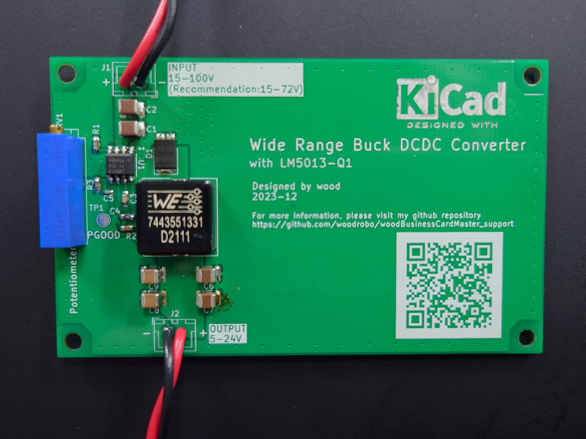
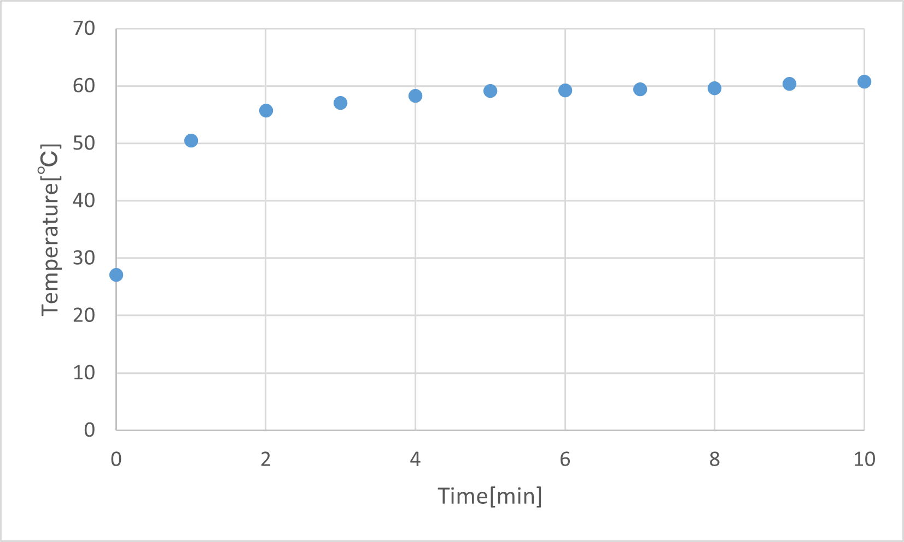
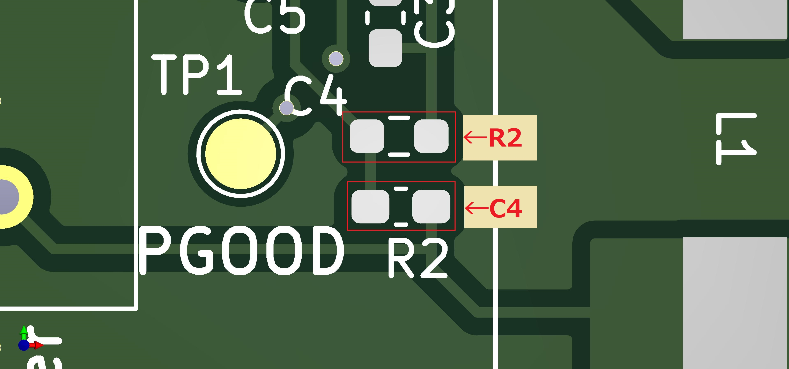

# woodBusinessCardMaster_support  
Non-Synchronous Buck DC/DC Converter featuring Wide Input Voltage
- Input Voltage:15-100V(recommendation:15-72V)
- Output Voltage:5-24V

  

  

# Load test  
Input Voltage:72V, Output Voltage:12V, Output Current:1A  

  

# How to make  
Please refer to "parts_list.csv".  
You can buy all components at Digi-Key online store.

# Errata  
"R2" and "C4" silks are in the wrong position.  
Please refer to the figure below.  

